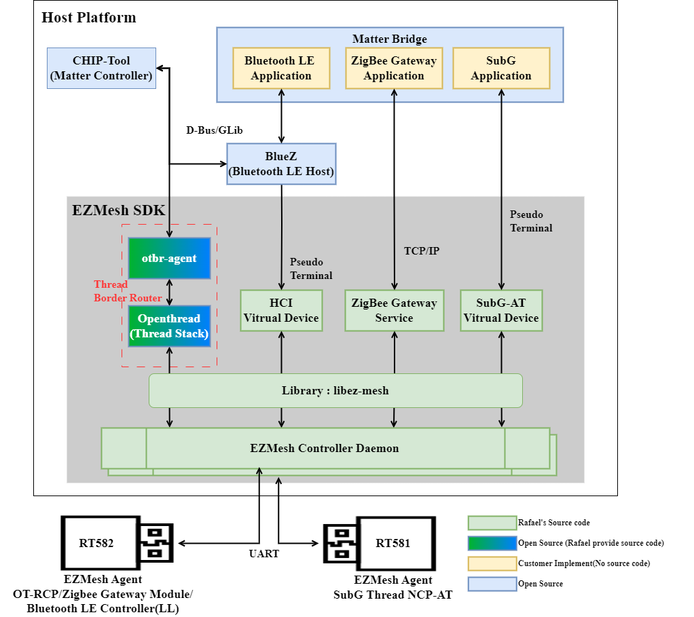

# EZMesh
The EZMesh SDK provides software source. It facilitates the easy development of an IoT gateway based on the EZMesh SDK architecture.

## Introduction

The EZMesh SDK contains support for running Zigbee, OpenThread, and Bluetooth on a Linux host, using only a single low-cost Radio Co-Processor (RCP) chip from Rafael Micro. This system allows for running multiple protocols simultaneously using the same RCP.
The EZMesh currently supports:

 

 

**The EZMesh Project is supported by Rafael Micro URL: [EN](https://www.rafaelmicro.com/en/)/[TW](https://www.rafaelmicro.com/tw/).**

---

## Support Platefrom

Currently, the EZMesh supports many building methods:

- Debian/Ubuntu: Recommend version
  - Ubuntu 22.04.3 LTS (Ubuntu-based)
  - Raspberry Pi OS (Legacy) Lite (Debian-based)
    - Release date: December 5th 2023
    - System: 64-bit
    - Kernel version: 6.1
    - Debian version: 11 (bullseye)
- OpenWRT: the EZMesh will become a package in the OpenWRT system
- Cross Compiler: Before integrating EZMesh, you can use the GCC toolchain to build EZMesh for testing and evaluation

### Build for various platforms

- Debian/Ubuntu: please follow [building_guide(debian_ubuntu)](doc/building_guide(debian_ubuntu).md) (<https://github.com/RafaelMicro/EZMesh/blob/master/doc/building_guide(debian_ubuntu).md>)
- OpenWRT: please follow [building_guide(OpenWRT)](doc/building_guide(OpenWRT).md) (<https://github.com/RafaelMicro/EZMesh/blob/master/doc/building_guide(OpenWRT).md>)
- Cross Compiler: please follow [building_guide(cross_compiler)](doc/building_guide(cross_compiler).md) (<https://github.com/RafaelMicro/EZMesh/blob/master/doc/building_guide(cross_compiler).md>)

---

## Directory Structure

The EZMesh repository is structured as follows:
|Folder/Files|Description|
|:---:|:---|
|build|Built output directories|
|cmake|Build module and extension for CMake|
|doc|Documentation for EZMesh|
|integrate|integrate different platform's files and configurations |
|module|EZMesh system module|
|test|Testing tool and program|
|CMakeList.txt|Cmake building project|
|third_party|Third party package|
|README.md|This file|
