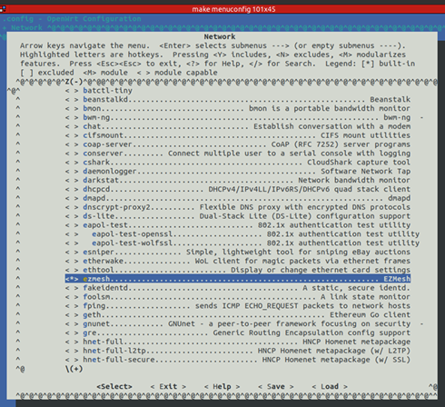
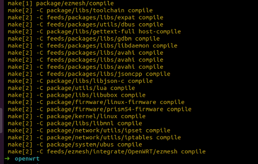
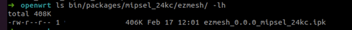
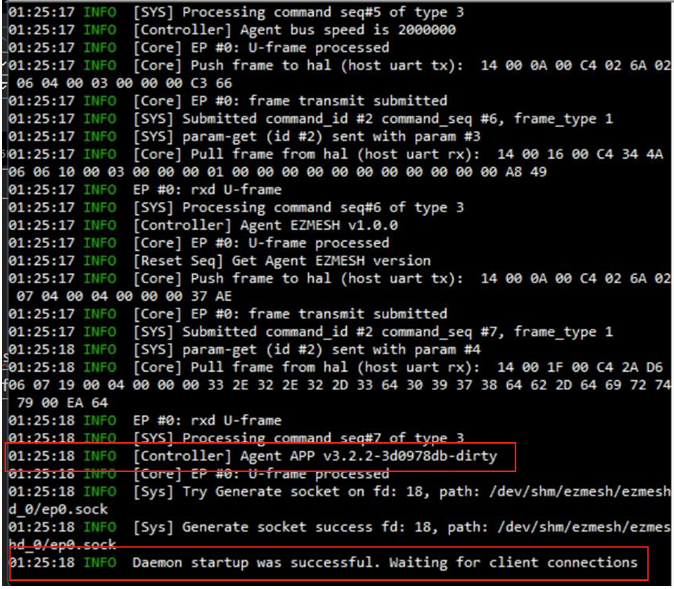
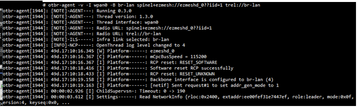

# BUILDING GUIDE With OpenWRT
## Setup EZMesh 
- Add ezmesh to your feeds.conf
    ```
    src-git ezmesh https://github.com/RafaelMicro/EZMesh.git 
    ```
    OR
    ```
    $ echo src-git ezmesh https://github.com/RafaelMicro/EZMesh.git >> feeds.conf 
    ```
- Update and install OpenWRT Setting
    ```
    $ ./scripts/feeds update ezmesh 
    $ ./scripts/feeds install -a -p ezmesh
    ```

---
## Enable EZMesh 
**EZMesh is a Network package under OpenWRT Platfrom.**</br>
EZMesh is not selected by default, so use menuconfig to select ezmesh
```
$ make menuconfig 
```
In the configure window, use the Up and Down keys to move the cursor and the Left and Right keys to choose an action. </br>
A. Select Network to enter its submenu. </br>
B. Enable ezmesh by moving the cursor to it and pressing Y. </br>
C. Select Exit to exit.</br>


---
## Build EZMesh on OpenWRT
OpenWRT can build all package or indiviual package.
- build all package
    ```
    $ make
    ```
    or build with debug mode.
    ```
    $ make -j1 V=sc
    ```
- build EZMesh package
    ```
    $ make package/ezmesh/compile 
    ```
    or build with debug mode.
    ```
    $ make -j1 V=sc package/ezmesh/compile 
    ```
    

---
## Apply EZMesh
The OpenWRT can flush frameware to the target board or insrtall package with opkg tool.
- install with opkg:</br>
  Copy the generated ipk file into OpenWRT, and install with opkg. 
  ```
  $ opkg install ezmesh_*.ipk
  ```
    

---
## Usage Ezmesh
### Start EZMesh 
- Start ezmesh daemon : ezmeshd
    ```
    $ ezmeshd -c /usr/etc/ez_config.ini
    ```
    

- Start OpenThread border Router:
    ```
    $ otbr-agent -v -I wpan0 -B br-lan spinel+ezmesh://ezmeshd_0??iid=1 trel://br-lan
    ```
    


